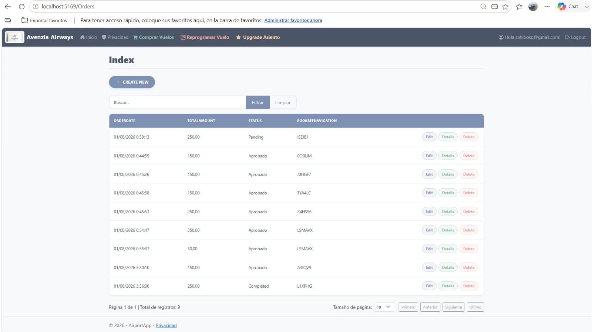
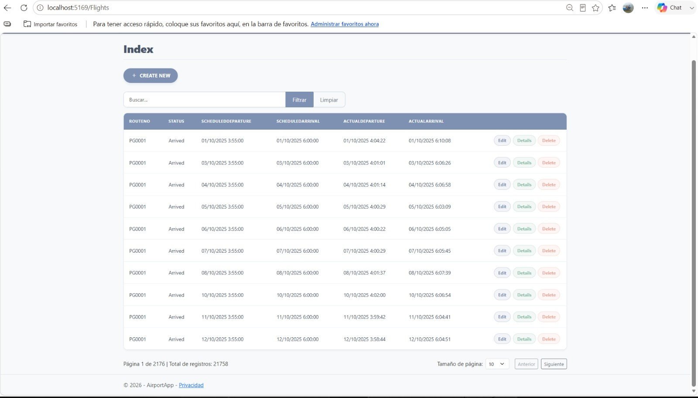
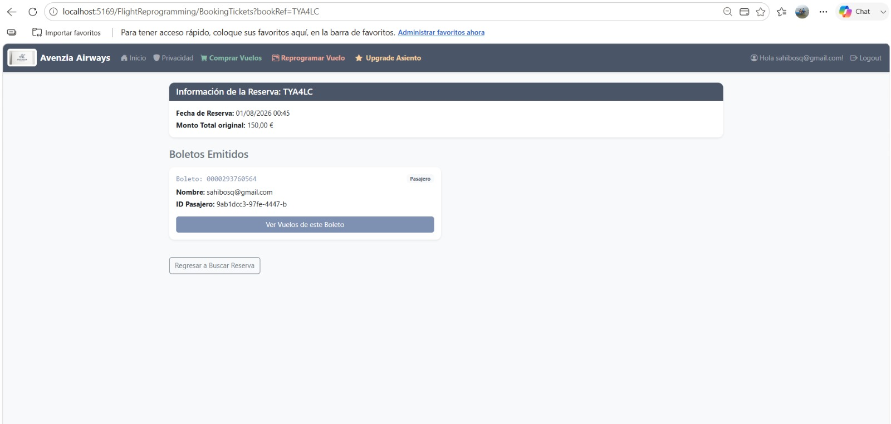
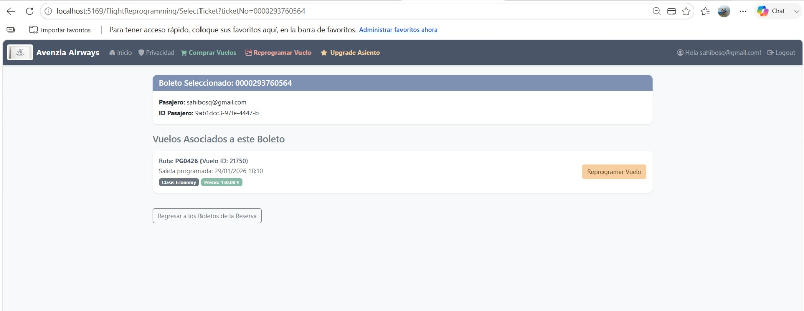
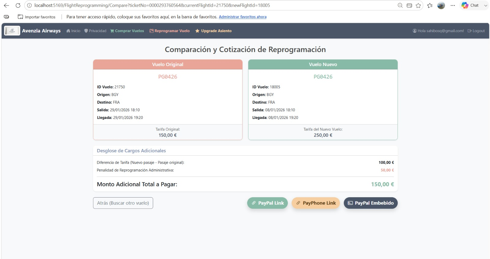
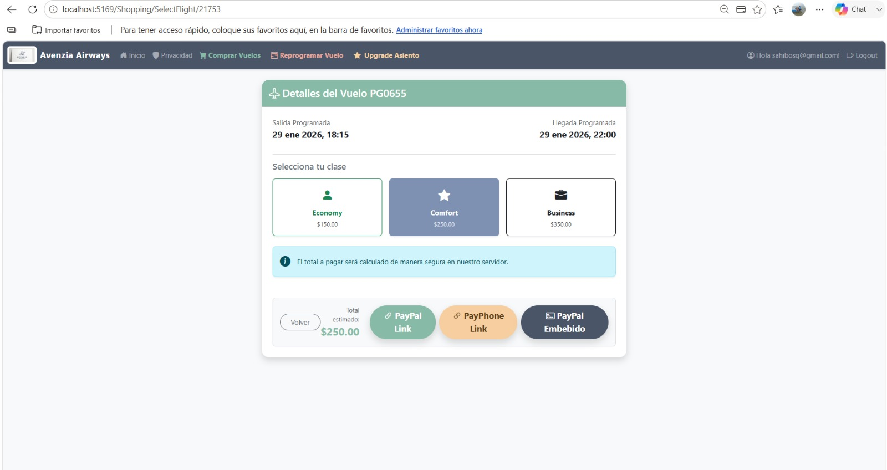
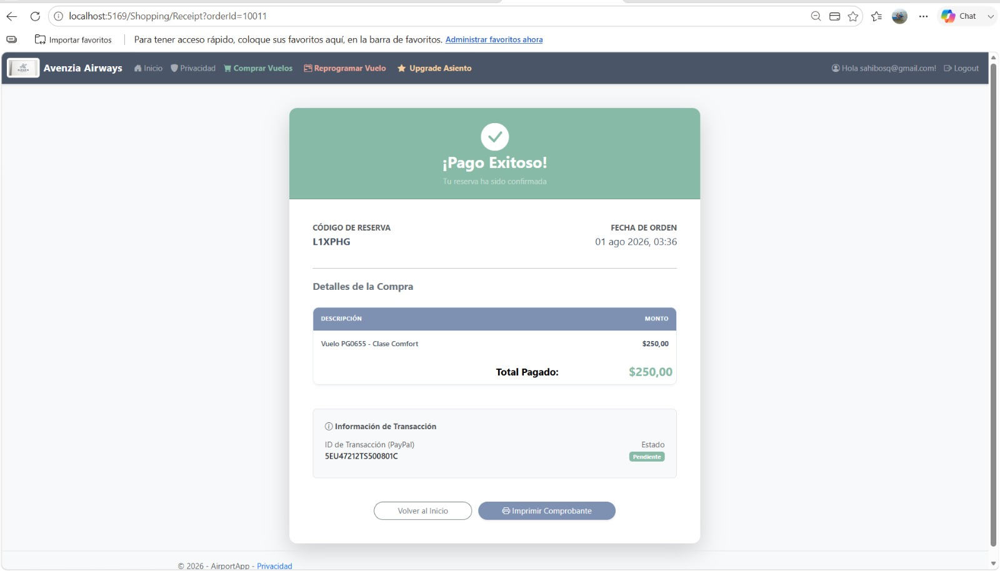

# Examen U3 - Sistema Aeroportuario ✈️

Este repositorio contiene la resolución del examen de la Unidad 3, que consiste en una aplicación web transaccional basada en la base de datos `airport`. El sistema gestiona procesos aeroportuarios e integra una pasarela de pago para la creación de órdenes.

## 📋 Descripción del Ejercicio
El objetivo principal de esta aplicación es permitir a los usuarios consultar vuelos, seleccionar asientos/servicios, realizar el pago y generar una orden completa en el sistema. Todo esto soportado por un backend robusto que recalcula precios, verifica transacciones y previene fraudes.

## 💳 Pasarela Utilizada
Se ha integrado **PayPal Sandbox** (y soporte para PayPhone) como pasarela de pago para procesar las transacciones. Las operaciones se manejan en un ambiente de pruebas y el sistema controla minuciosamente los estados de la orden (Pendiente, Completado, Fallido, Cancelado).

## 🚀 Tecnologías y Dependencias
* **Framework:** ASP.NET Core MVC (.NET 8/7)
* **Base de Datos:** PostgreSQL
* **ORM:** Entity Framework Core
* **Seguridad:** ASP.NET Core Identity (con roles de Administrador y Cliente)
* **Frontend:** HTML5, CSS3, Bootstrap 5
* **Integraciones:** API de PayPal, Google Authentication

## ⚙️ Configuración Necesaria

1. **Restaurar paquetes:**
   Ejecutar `dotnet restore` para descargar todas las dependencias de NuGet.

2. **Configuración de Variables:**
   Renombra o copia el archivo `AirportApp/appsettings.Example.json` y llámalo `appsettings.json`. Deberás rellenar:
   * La cadena de conexión a tu base de datos local PostgreSQL.
   * El `ClientId` y `Secret` de tu cuenta de PayPal Sandbox.
   * Las credenciales de Google Auth (opcional).

3. **Base de datos (Migraciones):**
   Abre la consola del administrador de paquetes o la terminal y ejecuta:
   ```bash
   dotnet ef database update
   ```
   Esto creará las tablas de Identity y pagos en tu base de datos `airport`.

## ▶️ Instrucciones de Ejecución

1. Abre una terminal en la carpeta `AirportApp`.
2. Ejecuta el comando:
   ```bash
   dotnet run
   ```
3. Abre tu navegador en la URL indicada (generalmente `https://localhost:7xxx`).

## 📸 Capturas Principales

A continuación se presentan capturas de pantalla del funcionamiento de la aplicación:

* **Inicio de Sesión y Registro:**
  
* **Pantalla de Inicio / Dashboard:**
  
* **Búsqueda y Compra de Vuelos:**
  
* **Selección de Clase y Checkout:**
  
* **Pasarela de Pago PayPal (Embedded):**
  
* **Administración de Vuelos y Reservas:**
  
* **Reportes y Consultas LINQ Avanzadas:**
  


---
**Nota de Seguridad:** Se ha implementado un archivo `.gitignore` para excluir estrictamente las carpetas `bin/`, `obj/`, `.vs/`, y especialmente los archivos `appsettings.json` o `.env` que contengan credenciales reales o ClientSecrets, garantizando el cumplimiento de las políticas de seguridad.
